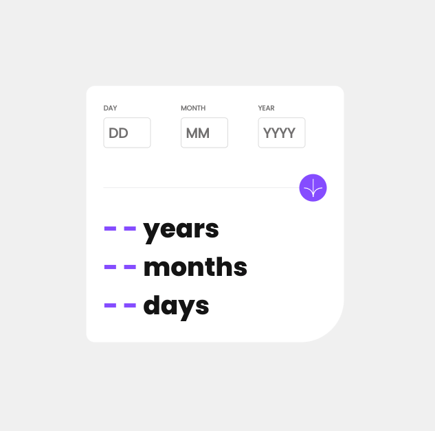
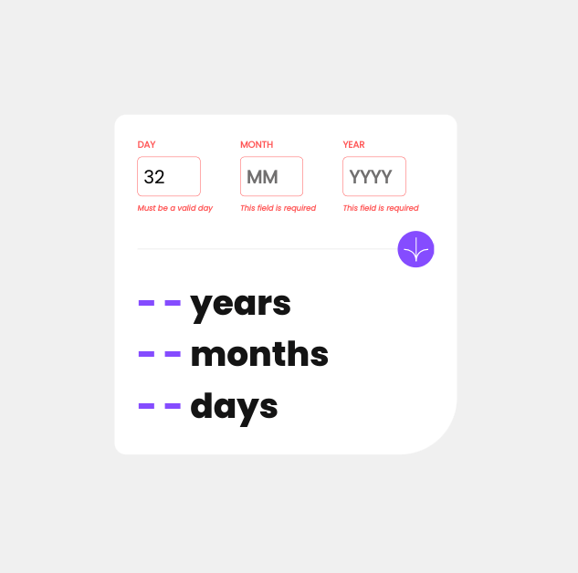
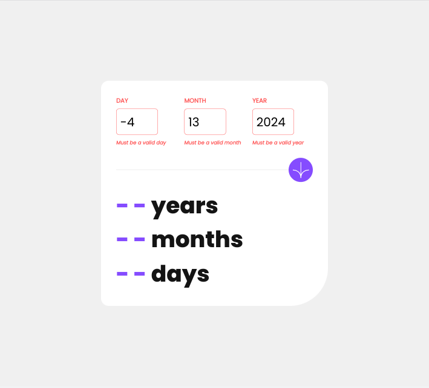
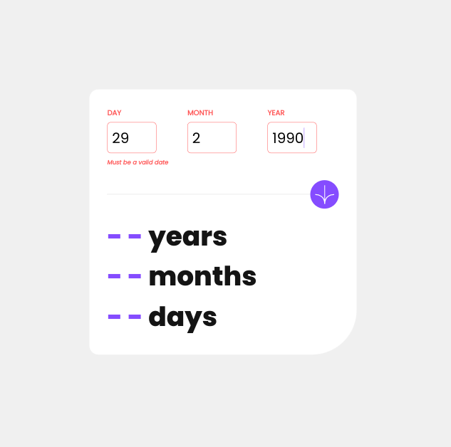
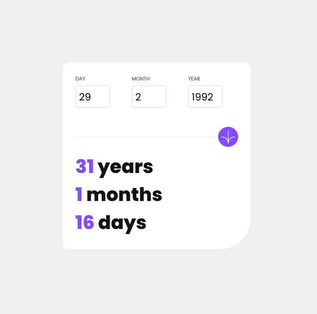

# Frontend Mentor - Age calculator app solution

This is a solution to the [Age calculator app challenge on Frontend Mentor](https://www.frontendmentor.io/challenges/age-calculator-app-dF9DFFpj-Q). Frontend Mentor challenges help you improve your coding skills by building realistic projects. 

## Table of contents

- [Overview](#overview)
  - [The challenge](#the-challenge)
  - [Screenshots](#screenshots)
- [My process](#my-process)
  - [Built with](#built-with)
  - [What I learned](#what-i-learned)
  - [Continued development](#continued-development)
  - [Useful resources](#useful-resources)

## Overview

### The challenge

Users should be able to:

- View an age in years, months, and days after submitting a valid date through the form
- Receive validation errors if:
  - Any field is empty when the form is submitted
  - The day number is not between 1-31
  - The month number is not between 1-12
  - The year is in the future
  - The date is invalid e.g. 31/04/1991 (there are 30 days in April)
- View the optimal layout for the interface depending on their device's screen size
- See hover and focus states for all interactive elements on the page
- **Bonus**: See the age numbers animate to their final number when the form is submitted

### Screenshots

***

***

***

***

***

***

***

***

## My process

### Built with

- Semantic HTML5 markup
- CSS custom properties
- Flexbox
- CSS Grid
- Mobile-first workflow
- [Angular CLI](https://github.com/angular/angular-cli) version 15.2.5
- [Angular](https://angular.io/)
- [date-fns](https://date-fns.org/)

### What I learned

- Angular CLI no longer works on node 14 and on node 18 you need to workaround resolving localhost.  
- Not the best design.  The readme description mentions submiting the form but the button / circle looks decorative and not like a submit button. 
- I originally did not have a submit button but changed to using one before I added the RealDateValidator.  
- I added a 'Submit' tooltip to the button.  
- No disabled color change on button in the design.  The button is not specified to be disabled at any time so you can add the validation error messages.
- Problematic to isolate custom form validator errors and remove a specific error - I used updateValueAndValidity to get around the problem of having a lingering dateError and its associated error styling being shown after values are updated to be valid. 
- Animation works well on first submission of form (localForm.submitted value is false) - but when you change any input value to another valid number the animation runs again on the previous submission values.  
- Used [Time And Date](https://www.timeanddate.com/) to verify calculation was working correctly.  
- Design should have included the end date that was used when the screenshot was taken.  
- Design is missing screenshot of error messages on mobile although error message would have to be '10px' to stay on one line.
- Put the invalid class on the containing div to lessen code repetition - could go even further and clean up the ngIfs ?
- When using ngIf have to worry about layout shift - better to use ngStyle or ngClass instead ?
- Wrapped the small tags with the error messages in a fixed height div to prevent the layout shift
- Angular testing is problematic if you use containers - you need to install a browser before you can run tests   
- Could make some semantic html adjustments in the results section - could use dl, dd, dt tags?
- Problem with dashes logic using localForm.submitted - after submitting form for the first time, once the form is valid again, the dashes disappear 
- tough to inspect the localForm variable - circular structure - thought I could look through its properties to fix the dash issue
- Could have done more to shrink the design for mobile - have to lower font-size / make inputs smaller etc

### Continued development

- Account for 'e' in the input type="number" fields
- Remove the arrows in the input type="number" fields ?
- Testing 
- Animation
- Mobile tweaks

### Useful resources

- [Github](https://github.com/angular/angular-cli/issues/24601) - angular cli and node 18 conflicts
- [Stack Overflow](https://stackoverflow.com/questions/43492354/how-to-allow-access-outside-localhost) - allow access outside localhost
- [Stack Overflow](https://stackoverflow.com/questions/47570251/display-reactive-form-elements-concurrently-real-time-in-angular) - display reactive form elements in real time
- [YouTube](https://www.youtube.com/watch?v=jdsSIKgJ6ZM) - Form Validation of Reactive Forms | Reactive Form | Angular 13+
- [Angular JS Wiki](https://www.angularjswiki.com/angular/object-is-possibly-null-error-fix/) - object is possibly null error fix
- [PluralSight](https://www.pluralsight.com/guides/how-to-display-validation-messages-using-angular) - validation messages
- [YouTube](https://www.youtube.com/watch?v=wOtPXAbxoM4) - Display Form Error Messages On Submit Using Angular Reactive Forms
- [Programiz](https://www.programiz.com/javascript/examples/check-leap-year) - check leap year
- [Stack Overflow](https://stackoverflow.com/questions/57086672/element-implicitly-has-an-any-type-because-expression-of-type-string-cant-b) - element implicitly has an any type
- [YouTube](https://www.youtube.com/watch?v=VmdSmeDpW0k) - Custom Validation and Error Code | Reactive Forms | Angular 13+
- [YouTube](https://www.youtube.com/watch?v=REbXP2OiGn8) - How to add custom validation with two field in Angular
- [YouTube](https://www.youtube.com/watch?v=mK0CX-68hBE) - Angular Reactive Forms: Learn How to Create A Custom Validator
- [Github](https://github.com/angular/angular/issues/44880) - Type '(formGroup: FormGroup) => null | undefined' is not assignable to type 'ValidatorFn'. #44880
- [Stack Overflow](https://stackoverflow.com/questions/40349987/how-to-suppress-error-ts2533-object-is-possibly-null-or-undefined) - object is possibly null or undefined
- [Stack Overflow](https://stackoverflow.com/questions/45069629/angular-abstract-control-remove-error) - abstract control remove error
- [Stack Overflow](https://stackoverflow.com/questions/65966720/error-ts2531-object-is-possibly-null-in-angular-reactive-forms) - error object is possibly null
- [W3 Schools](https://www.w3schools.com/howto/howto_css_placeholder.asp) - placeholder css
- [Github](https://github.com/angular/angular/issues/21564) - Forms: State that setErrors() will make status === INVALID regardless of value passed for key #21564
- [Stack Overflow](https://stackoverflow.com/questions/17732897/difference-between-two-dates-in-years-months-days-in-javascript) - difference between 2 dates in years, months, & days
- [YouTube](https://www.youtube.com/watch?v=8BatUQYtMlY) - 5 Angular Animations Examples - Learn BrowserAnimationsModule in Angular
- [Angular Docs](https://angular.io/guide/transition-and-triggers) - transition and triggers
- [Github](https://github.com/angular-schule/angular-cli-ghpages) - angular cli ghpages
- [Time and Date](https://www.timeanddate.com/) - used to verify calculation was working correctly 
- [Blog](https://blogs.halodoc.io/skip-repetition-in-angular-templates-with-custom-directives/) - custom directives
- [Stack Overflow](https://stackoverflow.com/questions/44151171/make-angular-ng-if-reserve-space-for-showing-if-event-occurs) - make angular ngIf reserve space for showing if event occurs
- [The Server Side](https://www.theserverside.com/blog/Coffee-Talk-Java-News-Stories-and-Opinions/gitkeep-push-empty-folders-git-commit#:~:text=What%20is%20.,to%20put%20a%20file%20named%20.) - gitkeep file
- [Stack Overflow](https://stackoverflow.com/questions/56822743/how-to-display-an-object-object-on-angular-ui) - display an object with json pipe
- [Stack Overflow](https://stackoverflow.com/questions/40363449/passing-form-status-data-between-parent-and-child-components) - passing form status data between parent and child components
- [Stack Overflow](https://stackoverflow.com/questions/43759590/angular-reactive-forms-how-to-reset-form-state-and-keep-values-after-submit) - reactive forms reset form state